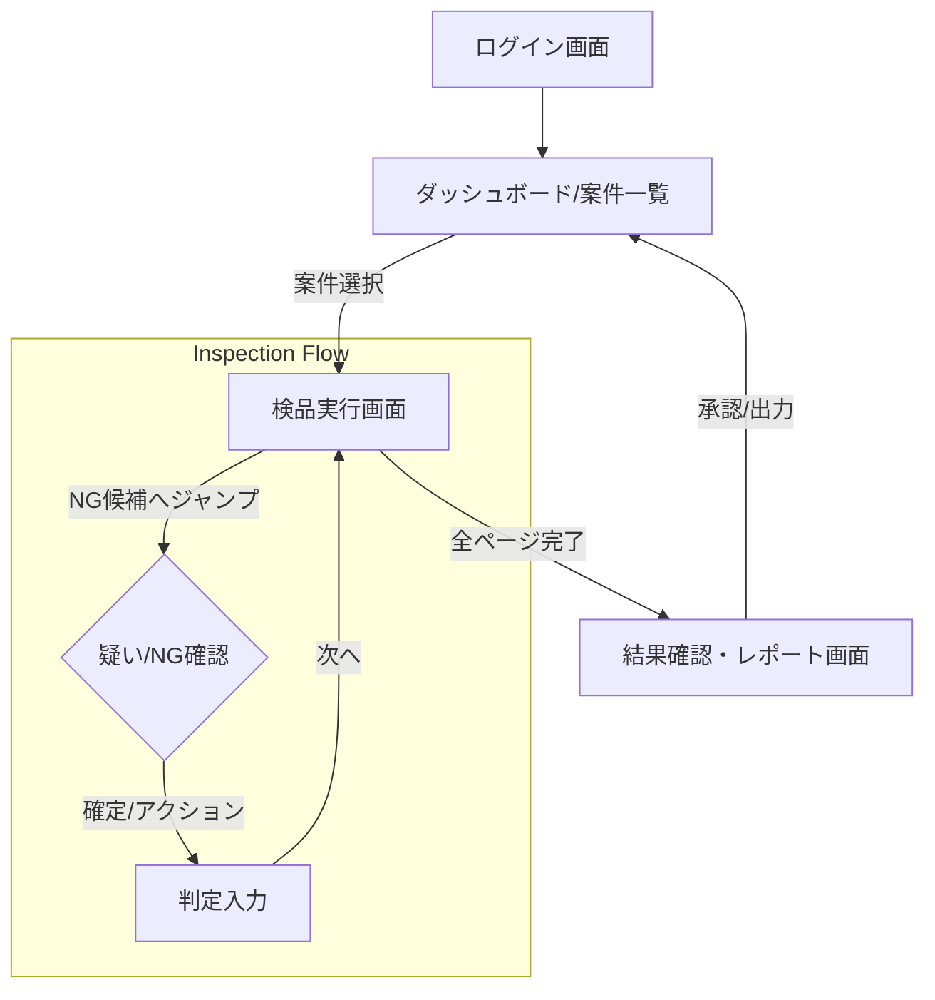
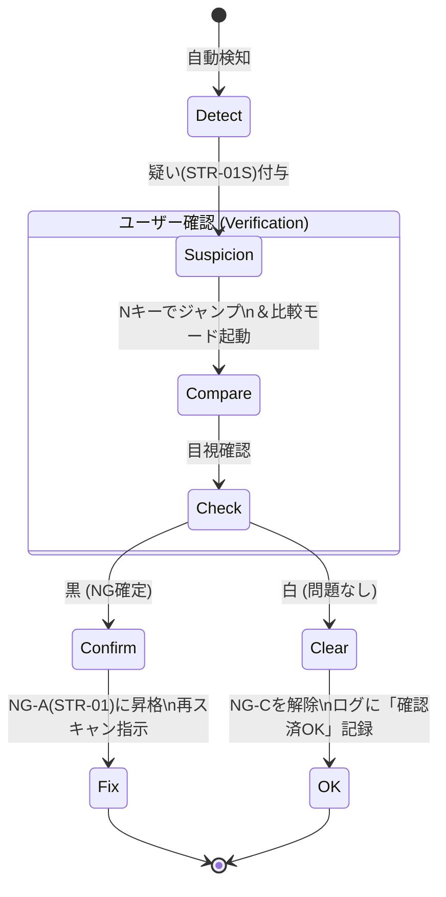

# 自動検品ツール UI詳細設計書

## 1. 概要
本ドキュメントは、`デザイン要件定義書.md`に基づき、自動検品ツールの具体的な画面構成（ワイヤーフレーム）、状態遷移、およびインタラクションの詳細を定義する。
特に「判断の均一化」と「スループット最大化」を実現するためのUI仕様を詳述する。

---


## 2. 画面遷移図 (Screen Flow)

案件選択から検品、結果出力までの一連の流れを定義する。
重要なのは、**検品実行画面（Inspection View）から離脱せずに全ての判断が完結する**ことである。



---


## 3. メイン検品画面 詳細設計

3ペイン構成の具体的な配置と役割を定義する。

### 3.1 画面レイアウト概要

```
+---------------------------------------------------------------+ 
| [Header] 案件名: 2024-A001 | 進捗: 450/1200 (37%) | 担当: UserA |
+-----------------------+-----------------------+---------------+ 
| [Left Pane: List]     | [Center Pane: Viewer] | [Right Pane]  |
|                       |                       | [Action]      |
| 001 [OK]              |                       |               |
| 002 [OK]              |      (Main Image)     | [Status]      |
| 003 [NG-C] (疑)       |                       |  Current: 004 |
| 004 [NG-A] < Focus    |    +-------------+    |  NG-A: 破れ   |
| 005 [OK]              |    |  Highlight  |    |               |
| 006 [OK]              |    +-------------+    | [Buttons]     |
| ...                   |                       |  [S] Rescan   |
|                       |                       |  [E] Except   |
| Filters:
| [x] All [ ] NG Only   |                       |  [Space] OK   |
|                       |                       | [Log/History] |
+-----------------------+-----------------------+---------------+ 
| [Footer] ShortCuts: J:Next K:Prev N:NextNG Z:Zoom C:Compare   |
+---------------------------------------------------------------+ 
```

### 3.2 各ペインの仕様

#### 左ペイン：ナビゲーション (List)
*   **リスト項目**: ページ番号、サムネイル（小）、ステータスアイコン。
*   **ステータス表示**:
    *   `OK` (緑): 自動検知なし、または確認済み。
    *   `Wait` (灰): 未確認。
    *   `Warn` (黄): **疑いあり (STR-01S等)**。ユーザー確認待ち。
    *   `NG` (赤): **確定済みNG**。
*   **フィルタ機能**: 「NG/疑いのみ表示」モードを搭載（ショートカット `F`）。

#### 中央ペイン：メインビューワー (Viewer)
*   **表示領域**: 画面の70%以上を占有。
*   **オーバーレイ**:
    *   検知されたNG箇所を矩形で囲む。
    *   NG区分に応じて枠色を変更（NG-A:赤, NG-B:橙, NG-C:黄）。
    *   マウスオーバーで詳細理由（例：「線状ノイズ(QLT-05): 確信度98%」）をツールチップ表示。
*   **比較モード (Compare)**:
    *   `C`キーでトグル。
    *   デフォルトは「単ページ表示」。
    *   比較時は「左：前ページ / 右：現ページ」または「左：基準画像 / 右：現ページ」を分割表示。

#### 右ペイン：操作・情報 (Action/Info)
*   **現在の判定**: 現在付与されているNGコードを表示。
*   **アクションボタン**:
    *   **OK (Space)**: 問題なしとして次へ。
    *   **再スキャン (S)**: NG-A確定。理由は自動入力（またはリストから選択）。
    *   **例外承認 (E)**: NG-B/Cのみ活性化。押下時、理由入力モーダルを展開。
*   **制約事項**:
    *   **NG-A検知時、「OK」ボタンは非活性化（または警告ダイアログ）**される。解除するには「誤検知としてマーク」する明示的な操作が必要。

---


## 4. インタラクションフローと状態遷移

「疑い」の解決プロセスをステートマシンとして定義する。

### 4.1 「疑い」解決フロー (STR-01S/03S)



1.  **Detect**: ツールがページ抜けの可能性（特徴量不連続）を検知し、`STR-01S` (NG-C) を付与。
2.  **Verify**: ユーザーが`N`キーを押すと、当該ページにジャンプし、**自動的に比較モード（前ページvs現ページ）**になる。
3.  **Action**:
    *   **NGの場合**: `S`キー（再スキャン）押下 → `STR-01S`が`STR-01` (NG-A) に書き換わる。
    *   **OKの場合**: `Space`キー（承認）押下 → `STR-01S`は履歴に残しつつ、ステータスは`OK`になる。

### 4.2 NG-A（致命不良）の制約フロー

*   **シナリオ**: 線状ノイズ (QLT-05) が検知された場合。
*   **UI挙動**:
    *   右ペインの「OK」ボタン、「例外承認」ボタンを**Disable（無効化）**。
    *   「再スキャン」ボタンのみがDefaultフォーカス。
    *   ユーザーが強制的にOKにしようとした場合、「**致命的な不良が検知されています。誤検知の場合は『誤検知報告』を行ってください**」と警告を表示。

---


## 5. コンポーネント定義

### 5.1 NG強調表示 (Overlay)

| 要素 | スタイル | 挙動 |
| :--- | :--- | :--- |
| **検知枠** | 2px solid [StatusColor] | 常に表示。非表示不可。 |
| **ラベル** | 背景色付きテキスト | 枠の左上にNGコード（例: QLT-05）を表示。 |
| **確信度** | 不透明度で表現 | 確信度が高いほど枠の色を濃く、低いほど薄く（最低50%担保）。 |

### 5.2 判定ボタン (Action Button)

| ボタン | キー | 色 | 活性条件 |
| :--- | :--- | :--- | :--- |
| **OK / 次へ** | Space | 緑 | NG-Aがない、または全ての疑いが解消済み。 |
| **再スキャン** | S | 赤 | 常時可。 |
| **例外承認** | E | 黄 | NG-B/Cのみ。NG-A時は非活性。 |
| **戻る** | K | 灰 | 常時可。 |

---


## 6. 例外処理・ログ

*   **例外承認モーダル**:
    *   ドロップダウンで「承認理由コード」を選択（必須）。
    *   フリーテキストで「備考」を入力（任意だが、推奨）。
*   **操作ログ**:
    *   「誰が」「いつ」「どの疑いを」「どう判断したか（OK/NG）」を全て記録する。
    *   特に「疑い→OK」の操作は、品質監査の重点チェック対象となるため、強調してログに残す。
