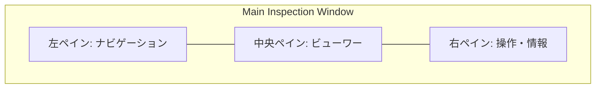

# 自動検品ツール デザイン要件定義書

## 1. デザインコンセプト

本ツールのデザインは、単なる「見栄え」ではなく、検品業務の**「スループット最大化」**と**「判定精度の均一化」**を最優先事項とする。

*   **Decision-First (判断優先)**: ユーザーが「見るべき場所」を即座に特定し、判断を下せるレイアウト。
*   **Zero-Mouse (キーボード完結)**: マウス操作を排除し、キーボードショートカットのみで高速に検品を完了できる操作体系。
*   **Visual Trust (視覚的信頼)**: ツールが検知した箇所の確信度や種類を、直感的な視覚効果（ハイライト、カラーコード）で提示。

---

## 2. ターゲットユーザー・利用環境

### 2.1 ユーザー層
*   **専任検品担当者**: 1日あたり数千〜数万ページの画像をチェックする。
*   **オペレーション管理者**: 検品進捗の管理と、最終的なレポートの確認を行う。

### 2.2 利用環境
*   **ハードウェア**: デスクトップPC（Intel Core i5以上推奨）
*   **モニタ**: フルHD (1920x1080) 以上、デュアルモニタ環境を強く推奨。
    *   *サブモニタに「前後ページ比較」や「拡大鏡」を常時表示するモードを備える。*

---

## 3. UI構造（3ペイン構成）

検品画面は以下の3つの領域で構成する。

1.  **左ペイン（サムネイル/一覧）**:
    *   案件内のページ一覧。
    *   自動検知された「NG候補」があるページには警告アイコンを表示。
    *   進捗状況（済/未/保留）を色分け。
2.  **中央ペイン（メインビューワー）**:
    *   検品対象画像を最大表示。
    *   **NG箇所のオーバーレイ**: ツールが検知した不良箇所（線状ノイズ、欠け等）を半透明の矩形で強調。
    *   **比較モード**: 必要に応じて、前後のページや、基準画像と並べて表示。
3.  **右ペイン（操作・ステータスパネル）**:
    *   現在のページに付与されたNGコード一覧。
    *   判定ボタン（OK、再スキャン、例外承認等）。
    *   例外承認理由の入力欄。

---

## 4. 操作設計（インタラクション）

### 4.1 キーボードショートカット（標準）

マウスに持ち替える時間をゼロにするため、以下のショートカットを固定実装する。

| キー | アクション | 備考 |
| :--- | :--- | :--- |
| `J` / `→` | 次ページへ | |
| `K` / `←` | 前ページへ | |
| `N` | 次の「NG候補」へジャンプ | 効率化の核心 |
| `Space` | 現在のページを「OK」として確定 | |
| `S` | 「再スキャン(NG-A)」として確定 | QLT-05等の場合 |
| `E` | 「例外承認」フォームへフォーカス | |
| `Z` | ズーム切替（1x / 2x） | |
| `C` | 比較モード切替 | |
| `F` | フィルタ切替（NG/疑いのみ） | |

### 4.2 フォーカス管理
*   画面遷移時、常に「判定ボタン」または「次のページボタン」にフォーカスが当たっている状態を維持する。
*   モーダルダイアログ表示時も、`Enter`で確定、`Esc`でキャンセルを徹底。

---

## 5. 視覚表現ガイドライン

### 5.1 ステータスカラー（セマンティックカラー）

| 区分 | 色 | 意図 |
| :--- | :--- | :--- |
| **OK** | 緑 (#28A745) | 安全、通過可能 |
| **NG-A** | 赤 (#DC3545) | 致命的、停止、再スキャン必須 |
| **NG-B** | 橙 (#FD7E14) | 要対応、再処理 |
| **NG-C** | 黄 (#FFC107) | 注意、目視確認 |
| **未検品** | グレー (#6C757D) | 未着手 |

### 5.2 ハイライト表示
*   **検知枠**: ツールが自動検知した箇所は、NG区分に応じた色の枠で囲む。
*   **ズーム追従**: `N`キーでNG候補ページに移動した際、自動的にNG検知箇所が画面中央に来るように初期ズーム・位置合わせを行う。

---

## 6. 主要画面の詳細要件

### 6.1 案件一覧画面
*   大量の案件を捌くため、ステータス（検品中、未着手、完了）でのフィルタリングを必須とする。
*   納期が近い案件、NG率が異常に高い案件を視覚的に強調。

### 6.2 検品実行画面
*   画像の読み込み遅延を感じさせないプログレッシブ読み込みまたはプリフェッチ（先読み）の実装。
*   大判図面（A0等）でもスクロールが滑らかであること。

### 6.3 結果レポート画面
*   「どこが、なぜNGになったか」を画像付きで一覧表示。
*   印刷時、1ページに収める情報量を最適化し、証跡としての視認性を確保。

---

## 7. アクセシビリティ・品質
*   **ダークモード対応**: 長時間の監視業務による眼精疲労を軽減するため、ダークテーマをデフォルトまたは選択可能とする。
*   **色覚多様性への配慮**: 色だけでなく、形状やアイコン（重畳、バツ印など）を併用してステータスを判別可能にする。
